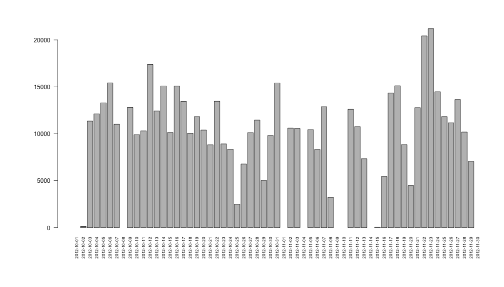
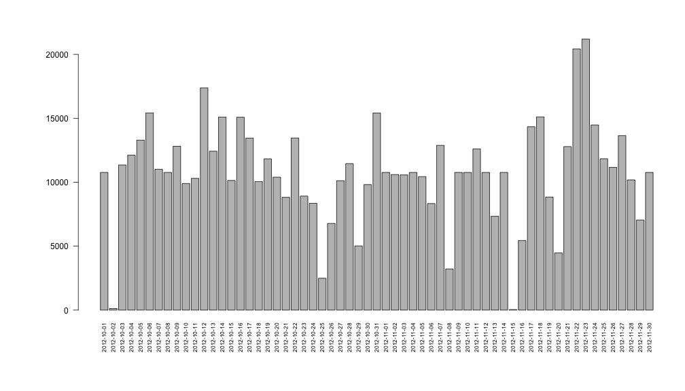
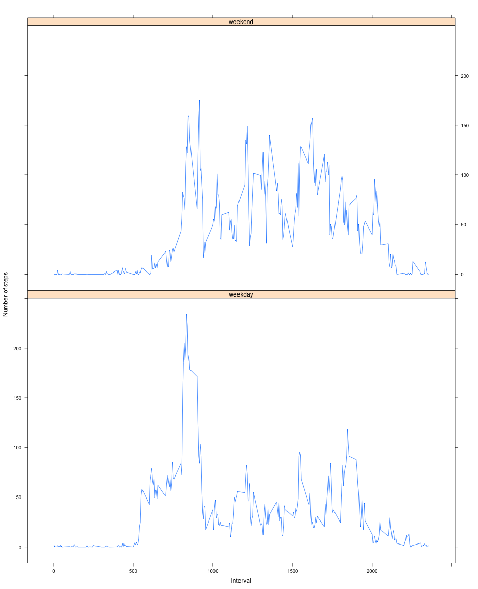

Reproducible Research: Peer Assessment 1 - Activity Monitoring Data
===================================================================


## Loading the data set and the relevant libraries


```r
library(reshape2)
library(plyr)
library(lattice)

if (!file.exists("./activity.csv")) {
    if (!file.exists("./activity.zip")) {
        url <- "https://d396qusza40orc.cloudfront.net/repdata%2Fdata%2Factivity.zip"
        download.file(url, "activity.zip", method = ifelse(.Platform$OS.type == 
            "windows", "internal", "curl"))
    }
    unzip("activity.zip")
}
data <- read.csv("activity.csv")
```


## Reformatting the data set

```r
melted <- melt(data, id.vars = c("date"))
```


## Total number of steps taken each day

```r
casted <- dcast(melted[melted$variable == "steps", ], date ~ variable, sum)
par(las = 2, mgp = c(4, 1, 0), mar = c(8, 8, 4, 1), cex.lab = 1.2)
barplot(casted$steps, names.arg = casted$date, cex.names = 0.7)
```

 


### The mean of the total steps taken per day is *1.0766 &times; 10<sup>4</sup>* and the median is *10765*

intervalMelt <- melt(data, id.vars=c("interval"))


## Average daily activity pattern

```r
intervalMelt <- melt(data, id.vars = c("interval"))
intervalMelt <- intervalMelt[intervalMelt$variable == "steps", ]
class(intervalMelt$value) <- "integer"
intervalCasted <- dcast(intervalMelt, interval ~ variable, mean, na.rm = TRUE)

plot(intervalCasted$steps, type = "l", xlab = "Interval", ylab = "Number of steps mean", 
    axes = FALSE)

axis(1, at = 1:288, labels = intervalCasted$interval)
```

 


## The 5-minute interval that contains the maximum number of steps (averaged accross days) is: *835*  

## Inputing missing values
The missing values will be replaced with the average of the corresponding 5-minutes interval (averaged accross days)


```r
completeCases = complete.cases(data)
cleanData <- data

for (i in 1:nrow(cleanData)) {
    row = cleanData[i, ]
    if (is.na(row$steps)) {
        cleanData[i, "steps"] = intervalCasted[intervalCasted$interval == row$interval, 
            "steps"]
    }
}
```


## Plotting a histogram of the total number of steps per day after inputing the missing values

```r
melted <- melt(cleanData, id.vars = c("date"))
casted <- dcast(melted[melted$variable == "steps", ], date ~ variable, sum)
par(las = 2, mgp = c(4, 1, 0), mar = c(8, 8, 4, 1), cex.lab = 1.2)
barplot(casted$steps, names.arg = casted$date, cex.names = 0.7)
```

 


### The mean of the total steps taken per day is *1.0766 &times; 10<sup>4</sup>* and the median is *1.0766 &times; 10<sup>4</sup>*
The values are the same as the values obtained with ra.rm = TRUE  
Which is mathematically correct since the values we added are equal to the mean of each corresponding 5-minute interval 


## Difference in activity patterns between weekdays and weekends

```r
cleanData <- data
melted <- melt(cleanData, id.vars = c("date", "interval"))
melted$date = as.Date(melted$date)
melted <- cbind(melted, weekdays(melted$date))
colnames(melted)[5] <- "weekend"
melted$weekend <- melted[, "weekend"] == "Saturday" | melted[, "weekend"] == 
    "Sunday"

casted <- dcast(melted[melted$variable == "steps", ], interval + weekend ~ variable, 
    mean, na.rm = TRUE)
casted[casted$weekend, "weekend"] = "weekend"
casted[casted$weekend == "FALSE", "weekend"] = "weekday"

xyplot(steps ~ interval | weekend, data = casted, type = "l", xlab = "Interval", 
    ylab = "Number of steps")
```

 


